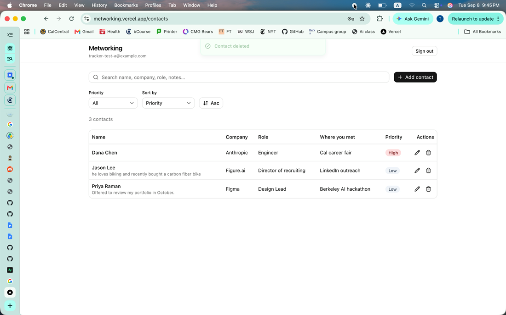
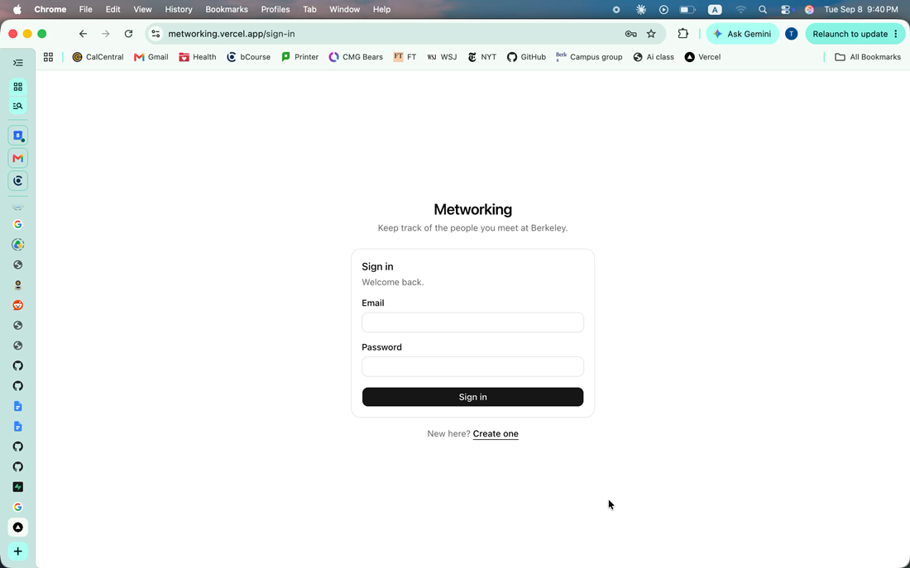
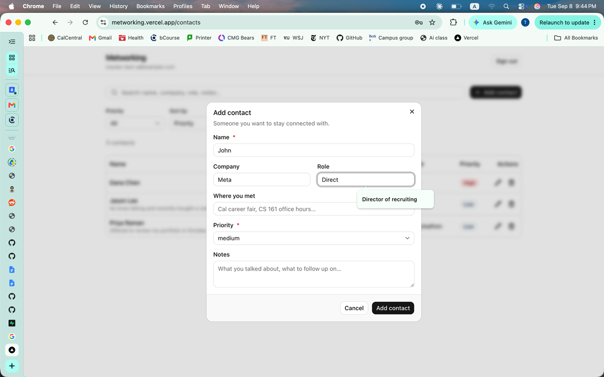
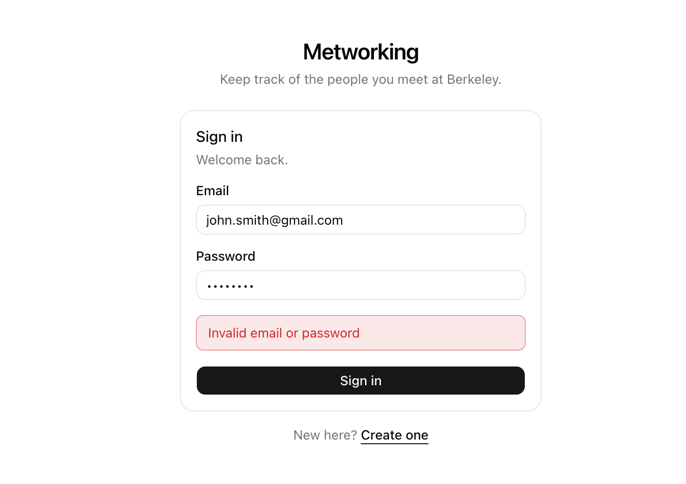
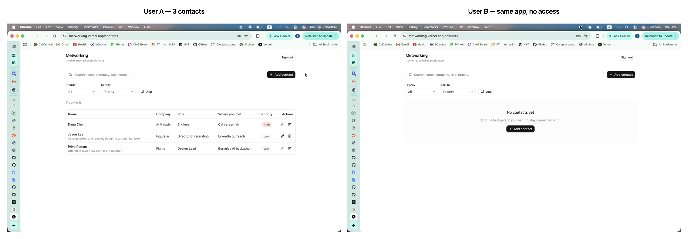

# Metworking

A private networking tracker for the people you meet at Berkeley. Each signed-in
user keeps their own list of contacts — name, company, role, where you met,
notes, and a priority — and can create, view, edit, delete, sort, and filter
them. The interesting part is not the CRUD: it is that **no application code
decides who owns a row**. The browser talks straight to Postgres over HTTPS
through the Neon Data API, and Postgres itself enforces both ownership (Row
Level Security) and validity (CHECK constraints). A user cannot reach another
user's data even by calling the REST endpoint directly with their own valid
token, which is exactly what the automated tests demonstrate.

- **Live app:** https://metworking.vercel.app
- **Repository:** https://github.com/greycatallen/metworking

---

## Table of contents

1. [Screenshots](#screenshots)
2. [Features](#features)
3. [Technology stack and why](#technology-stack-and-why)
4. [Architecture](#architecture)
5. [Local setup](#local-setup)
6. [Environment variables](#environment-variables)
7. [Database schema](#database-schema)
8. [Authentication and RLS ownership](#authentication-and-rls-ownership)
9. [Testing](#testing)
10. [Deployment](#deployment)
11. [Grading evidence](#grading-evidence)
12. [Known limitations and next steps](#known-limitations-and-next-steps)

---

## Screenshots

### Walkthrough recordings

Both were recorded against the live Vercel deployment.

| Recording | What it shows |
| --- | --- |
| **▶ [Sign in and sign out](docs/demo-signin-signout.mov)** (24s) | Signing in, the contact list loading, signing out, and landing back on the sign-in page |
| **▶ [Add, edit, and delete a contact](docs/demo-contact-crud.mov)** (56s) | Creating a contact, editing its role and notes, and deleting it — each with its confirmation dialog and success toast |

[](docs/demo-contact-crud.mov)

> GitHub does not play video inline in a README. Click a link above and GitHub
> renders a player on the file page.

### Stills

| | |
| --- | --- |
|  |  |
| The sign-in page | The Add contact dialog |
|  |  |
| Bad credentials rejected with a clear message | User B cannot see User A's contacts |

## Features

- Email + password sign up, sign in, and sign out (Managed Better Auth)
- A contact list private to each user, persisted in Neon Postgres
- Create, edit, and delete contacts, with a confirmation step before deleting
- Fields: name, company, role, where you met, notes, priority
- Priority is a closed set: `high`, `medium`, `low`
- **Sort** by priority, name, company, or date added, ascending or descending
- **Filter** by priority, plus full-text search across name, company, role,
  where you met, and notes
- Distinct loading, empty, error, and success states — including a separate
  empty state for "no contacts yet" versus "nothing matched your filters"
- Responsive: a table on desktop, cards on mobile
- Contacts survive a browser refresh because they live in Postgres, not in
  component state

## Technology stack and why

| Layer | Choice | Why |
| --- | --- | --- |
| Framework | Next.js 16 (App Router), TypeScript | Vercel-native, and the App Router keeps routing and layout simple for an app this size |
| Styling | Tailwind CSS v4 + shadcn/ui (Radix) | A real component system: `Dialog`, `Select`, and `Table` come with focus management and keyboard support that would take days to write correctly by hand |
| Auth | Neon Managed Better Auth | Issues the JWT whose `sub` claim Postgres reads through `auth.user_id()`, so auth and authorization share one identity with no syncing |
| Data | Neon Data API (PostgREST) via `@neondatabase/neon-js` | Removes the server tier from the request path, which forces the security rules into the database where they cannot be bypassed |
| Database | Neon Postgres 18 | RLS and CHECK constraints are the actual security model |
| Tests | Vitest | Fast, TypeScript-native, no configuration beyond a path alias |
| Hosting | Vercel | First-class Next.js support |

## Architecture

```
Browser (Next.js client components)
  │
  │  src/lib/contacts.ts ── the only module that touches the database
  │
  ├──── HTTPS ────► Managed Better Auth        (sign up / sign in / sign out)
  │                    │
  │                    └── issues a JWT whose `sub` is the user id
  │
  └──── HTTPS ────► Neon Data API (PostgREST)  Authorization: Bearer <JWT>
                       │
                       ▼
                    Postgres
                       ├── auth.user_id()  reads `sub` from the JWT
                       ├── RLS policies    scope every statement to that user
                       └── CHECK constraints validate every write
```

**Where the frontend ends and the backend begins.** There is no Node server in
the data path, so "backend" here means the database. That is a deliberate
reading of the requirement rather than a shortcut: because the Data API is
public, any rule enforced in JavaScript would be advisory only — a grader could
open the browser console, or `curl` the endpoint, and skip it. Putting the rules
in Postgres makes them apply to *every* caller, including one who never loads
the app. The tests prove this by attacking the REST endpoint directly.

**Separation inside the frontend.** UI components never construct a query.
Everything goes through [`src/lib/contacts.ts`](src/lib/contacts.ts), which owns
query construction, ordering, and error translation. Notably, *no query in that
file filters by `user_id`* — it does not need to, because RLS scopes every
statement to the caller. Ownership therefore cannot be forgotten at a call site,
which is the class of bug that leaks other people's data.

**Layered validation.** [`src/lib/validation.ts`](src/lib/validation.ts) mirrors
the database constraints so the form can show a message next to the offending
field instead of waiting for a round trip. The database remains the authority;
[`src/lib/errors.ts`](src/lib/errors.ts) maps constraint names such as
`contacts_priority_valid` back to a specific sentence, so a rejected write still
produces a useful message rather than a raw Postgres error.

## Local setup

```bash
git clone https://github.com/greycatallen/metworking.git
cd metworking
npm install
cp .env.example .env.local   # then fill in the two public URLs
npm run dev
```

Open http://localhost:3000.

To point this at your own Neon project:

1. Create a Neon project.
2. Enable **Managed Better Auth** (Auth → Configuration).
3. Enable the **Data API** with "Use Managed Better Auth" and "Grant public
   schema access" checked.
4. Apply [`db/migrations/0001_init.sql`](db/migrations/0001_init.sql) then
   [`db/migrations/0002_priority_rank.sql`](db/migrations/0002_priority_rank.sql)
   in the Neon SQL Editor.
5. Click **Refresh schema cache** on the Data API page. PostgREST caches the
   schema, and skipping this makes new tables and columns return 404.
6. Add `http://localhost:3000` to Neon Auth's trusted domains.
7. Copy the Auth URL and Data API URL into `.env.local`.

> **Note on `.npmrc`.** It sets `legacy-peer-deps=true`. The beta
> `@neondatabase/neon-js` package has an unresolvable peer conflict inside its
> own Better Auth dependency graph (`better-call` 1.3.7 vs 1.4.0) that npm 11
> treats as a hard error. This is committed so a fresh `npm install` succeeds.

## Environment variables

Names and placeholders live in [`.env.example`](.env.example). Real values
belong in `.env.local`, which is git-ignored.

| Variable | Scope | Purpose |
| --- | --- | --- |
| `NEXT_PUBLIC_NEON_AUTH_URL` | public | Managed Better Auth HTTPS endpoint |
| `NEXT_PUBLIC_NEON_DATA_API_URL` | public | Neon Data API HTTPS endpoint |
| `DATABASE_URL` | **server only** | Applying migrations. Bypasses RLS |
| `TEST_USER_A_EMAIL` / `TEST_USER_A_PASSWORD` | server only | RLS isolation test |
| `TEST_USER_B_EMAIL` / `TEST_USER_B_PASSWORD` | server only | RLS isolation test |

The two `NEXT_PUBLIC_` URLs are shipped to the browser deliberately. They are
endpoints, not credentials: every row behind them is protected by RLS, and the
`anonymous` Postgres role has **no privileges at all** on `contacts`, so an
unauthenticated request is refused before RLS is even consulted.

`DATABASE_URL` is never imported by application code. The app does not need it —
the browser reaches Postgres through the Data API, not a connection string.

## Database schema

Defined in [`db/migrations/`](db/migrations). Table `public.contacts`:

| Column | Type | Null | Default | Notes |
| --- | --- | --- | --- | --- |
| `id` | `bigint` | no | identity | Primary key |
| `user_id` | `text` | no | `auth.user_id()` | Owner. Never sent by the client |
| `name` | `text` | no | — | Required; must not be blank |
| `company` | `text` | yes | — | |
| `role` | `text` | yes | — | |
| `met_at` | `text` | yes | — | Where you met |
| `notes` | `text` | yes | — | |
| `priority` | `text` | no | `'medium'` | One of `high`, `medium`, `low` |
| `created_at` | `timestamptz` | no | `now()` | |
| `updated_at` | `timestamptz` | no | `now()` | Maintained by a trigger |
| `priority_rank` | `smallint` | — | generated | `high`→1, `medium`→2, `low`→3 |

Constraints:

| Constraint | Rule |
| --- | --- |
| `contacts_name_not_blank` | `length(trim(name)) > 0` |
| `contacts_name_max_len` | `length(name) <= 200` |
| `contacts_priority_valid` | `priority IN ('high','medium','low')` |
| `contacts_user_id_not_blank` | `length(trim(user_id)) > 0` |

`priority_rank` exists so that "sort by priority" is a real `ORDER BY` returning
high → medium → low. Sorting on `priority` itself would give *high, low, medium*
— alphabetical, and meaningless to a user. It is `GENERATED ALWAYS`, so it stays
in sync with `priority` by construction and a client cannot write it.

## Authentication and RLS ownership

Managed Better Auth issues a JWT whose `sub` claim is the user's id. The Data
API forwards that token to Postgres, where **`auth.user_id()` returns that `sub`
as text**. The `user_id` column defaults to it, so the client never sends an
owner — it is stamped server-side from a signed token the client cannot forge.

Row Level Security is enabled on `contacts`, with a separate policy per
operation:

```sql
CREATE POLICY contacts_select_own ON contacts FOR SELECT TO authenticated
  USING (auth.user_id() = user_id);

CREATE POLICY contacts_insert_own ON contacts FOR INSERT TO authenticated
  WITH CHECK (auth.user_id() = user_id);

CREATE POLICY contacts_update_own ON contacts FOR UPDATE TO authenticated
  USING (auth.user_id() = user_id)
  WITH CHECK (auth.user_id() = user_id);

CREATE POLICY contacts_delete_own ON contacts FOR DELETE TO authenticated
  USING (auth.user_id() = user_id);
```

**Why `UPDATE` needs both clauses.** `USING` is evaluated against the row as it
exists *before* the update: it decides which rows you are allowed to touch.
`WITH CHECK` is evaluated against the row *after* the update. Without it, a user
could take a row they legitimately own and rewrite its `user_id` to someone
else's — handing over their row, or worse, planting a row in another user's
list. With it, the post-update row must still belong to the caller, so the
attempt fails with `42501`. There is a test for exactly this.

**Request flow, end to end.** Sign in → Better Auth returns a session and a JWT
→ the SDK attaches `Authorization: Bearer <jwt>` to every Data API call →
PostgREST passes the token to Postgres and runs as the `authenticated` role →
`auth.user_id()` reads `sub` → the policy's `USING` / `WITH CHECK` clauses filter
or reject → CHECK constraints validate the values → the row is returned or the
statement errors.

## Testing

```bash
npm test
```

**29 tests, all passing.** Captured output: [`docs/test-output.txt`](docs/test-output.txt).

**Unit tests** (15) — [`src/lib/validation.test.ts`](src/lib/validation.test.ts).
Pure functions, no network. They pin the client-side validation to the SQL
constraints: blank and whitespace-only names are rejected, the 200-character
boundary holds, `priority` accepts only the three lowercase values (`"HIGH"` and
`"urgent"` are rejected rather than coerced), multiple bad fields are reported at
once, blank optional fields normalise to `null`, and the validator never emits a
`user_id` — ownership is the database's job.

**Integration tests** (14) — [`tests/rls.integration.test.ts`](tests/rls.integration.test.ts).
These sign in as two real accounts and attack the **live, public Data API** with
raw `fetch`, deliberately bypassing the app's own data layer — the point is to
behave like an attacker, not like the UI. They assert that:

- `user_id` is stamped from the JWT even though the client never sent it
- User B cannot see any row belonging to User A
- User B's `UPDATE` and `DELETE` against A's row affect nothing, and A's row is
  unchanged afterwards
- User A cannot reassign their own row to User B (`403`, `42501`)
- A user cannot insert a row owned by someone else (`403`, `42501`)
- Unauthenticated reads are refused outright
- `priority: "urgent"`, empty names, whitespace-only names, and over-length names
  are all rejected by Postgres (`23514`) when sent straight to the REST endpoint
- The generated `priority_rank` column cannot be written by a client

The integration suite skips itself when the test-account variables are absent, so
`npm test` stays green on a fresh clone with no credentials.

## Deployment

Deployed to Vercel from the CLI:

```bash
vercel link --yes --project metworking
vercel env add NEXT_PUBLIC_NEON_AUTH_URL production --type config
vercel env add NEXT_PUBLIC_NEON_DATA_API_URL production --type config
vercel deploy --prod
```

Three details that are easy to get wrong:

1. **`--type config` is required.** Vercel now refuses to set a `NEXT_PUBLIC_`
   variable without stating whether it is a public `config` value or a private
   `secret`. These two are genuinely public endpoints, so `config` is correct —
   but the prompt is a good guard, and the answer for a connection string would
   be different.
2. **Add every deployed domain to Neon Auth's trusted domains.** Better Auth
   validates the request `Origin`. Registered here: `http://localhost:3000`,
   `https://metworking.vercel.app`, and `https://metworking-allen-code1.vercel.app`.
   Sign-in fails silently on any origin that is not listed.
3. **Set the environment variables before building.** `NEXT_PUBLIC_` values are
   inlined into the client bundle at build time, not read at runtime, so adding
   them after a deploy has no effect until you redeploy.

### Continuous deployment is not connected

`vercel git connect` currently fails with *"You need to add a Login Connection
to your GitHub account first"*, so pushes to `main` do **not** redeploy
automatically. Deploys are manual (`vercel deploy --prod`) until that is
connected. To enable it: Vercel → Account Settings → Login Connections → connect
GitHub, then run `vercel git connect` in this directory.

### Verified on the live URL

- Sign in, sign out, and the signed-out route guard
- Contacts load, persist across refresh, and sort by priority
- Two-account privacy: signed in as User B on the production site, none of User
  A's contacts are visible and the empty state renders instead

## Grading evidence

| Requirement | Where |
| --- | --- |
| Automated test output, ≥1 passing validation test | [`docs/test-output.txt`](docs/test-output.txt) — 29 passing |
| Sign in and sign out | [`docs/demo-signin-signout.mov`](docs/demo-signin-signout.mov) — screen recording |
| Create, edit, delete, refresh | [`docs/demo-contact-crud.mov`](docs/demo-contact-crud.mov) — screen recording |
| Two-account privacy test | `docs/screenshots/06-two-accounts.png` + the 9 RLS tests |
| Invalid input failing safely | `docs/screenshots/07-signin-error.png` (bad credentials), plus the 9 Postgres validation tests in [`docs/test-output.txt`](docs/test-output.txt) covering blank names, over-length names, and invalid priorities |
| Schema and RLS explanation | [Database schema](#database-schema), [Authentication and RLS ownership](#authentication-and-rls-ownership) |
| No committed secrets | `.env.example` holds placeholders only; `.env*` is git-ignored except the template |

## Known limitations and next steps

- **The route guard is client-side.** `/contacts` redirects signed-out visitors
  with an effect, which is a UX convenience, not a security control. It is not
  load-bearing: a visitor who defeated the redirect would still see nothing,
  because every query is gated by RLS and the `anonymous` role has no privileges
  on the table. Moving the check to middleware would avoid the brief loading
  state.
- **No pagination.** The list fetches every matching row. Fine for a personal
  contact list, wrong at a few thousand rows; the next step is keyset pagination
  on `(priority_rank, id)`, which the existing index already supports.
- **`@neondatabase/neon-js` is beta**, which is why `.npmrc` pins
  `legacy-peer-deps`. That workaround should be removed once the peer conflict
  in the SDK's dependency graph is fixed upstream.
- **Email verification is off**, so sign-up grants immediate access. Enabling it
  is a Neon Auth configuration change plus a "check your email" state.
- **No optimistic UI.** Every mutation refetches the list, which is simple and
  always consistent but shows a brief pause on a cold Neon compute (the free tier
  scales to zero).
- **Delete is permanent.** A soft-delete column plus an undo toast would be
  friendlier, at the cost of an extra RLS predicate.
